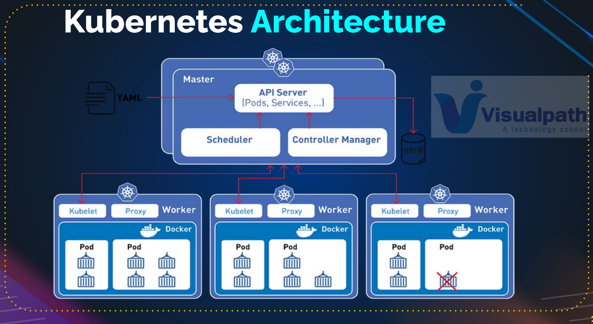
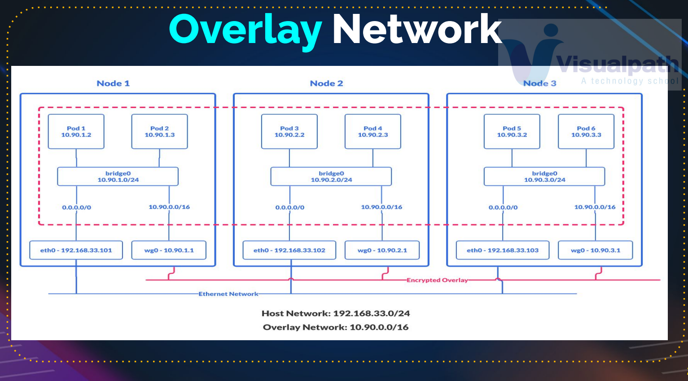

# 🧱 Kubernetes Fundamentals & Labs

## 📘 Overview

This repository showcases hands-on mastery of Kubernetes fundamentals through real-world lab exercises, YAML configurations, and Helm-based deployments — designed for DevOps recruiters and practitioners evaluating practical container orchestration skills.

It covers core Kubernetes concepts (Pods, Deployments, Services, ReplicaSets, ConfigMaps, Secrets, Namespaces, Ingress, Volumes, etc.) and extends to Helm packaging with a WordPress deployment for real practice.  
The focus is on learning by doing — deploying, scaling, and managing workloads on **Minikube**, **Kops (AWS)**, and **Lens** clusters.

💼 This project is part of my **DevOps Lab Series** — demonstrating Kubernetes automation, orchestration, and cluster-level deployment proficiency.

---

## 🏗️ Architecture

  
   
  <em>⚙️ Kubernetes Architecture — Control Plane & Worker Node Components</em>

### 🧩 Control Plane Components
| **Component** | **Description** |
|----------------|------------------|
| **API Server** | Entry point for all cluster communication; processes REST commands from kubectl. |
| **Scheduler** | Assigns Pods to suitable Nodes based on resource availability. |
| **Controller Manager** | Ensures the desired state (replicas, endpoints, etc.) matches the current cluster state. |
| **etcd** | Distributed key-value store maintaining cluster configuration and state. |

### 🧩 Node Components
| **Component** | **Description** |
|----------------|------------------|
| **Kubelet** | Communicates with the API Server and ensures containers are running as defined. |
| **Kube-Proxy** | Manages networking rules for Pod and Service connectivity. |
| **Container Runtime (Docker/Containerd)** | Executes container workloads inside Pods. |

---

## 🌐 Overlay Network

  
   
  <em>🌐 Overlay Networking — Pod-to-Pod Communication Across Nodes</em>

Each Node hosts multiple Pods, each assigned a unique IP address within the cluster network.

The overlay network (e.g., **Flannel**, **Calico**) enables cross-node Pod communication through virtual subnets.

The **bridge interface** manages intra-node communication, while **vxlan** or **wg0** interfaces handle encrypted inter-node tunnels.

---

## ⚙️ Core Concepts Practiced
| **Category** | **Key Topics** |
|---------------|----------------|
| **Cluster Setup** | Minikube installation, Kops configuration, kubeconfig context setup |
| **Workload Management** | Pods, ReplicaSets, Deployments, and Rollouts |
| **Networking** | Services (ClusterIP, NodePort, LoadBalancer), DNS, Ingress |
| **Configuration Management** | ConfigMaps, Secrets, Environment Variables |
| **Storage** | Volumes, PersistentVolumeClaims (PVCs) |
| **Access Control** | Namespaces, RBAC concepts |
| **Automation** | YAML manifests, Helm charts for templating |
| **Monitoring & Debugging** | kubectl logs, Lens UI, kubectl describe, kubectl get events |

---

## 🧪 Hands-On Lab Highlights
| **Lab** | **Description** |
|---------|----------------|
| **Pod & ReplicaSet Lab** | Deploy and scale Pods using declarative YAML manifests. |
| **Deployment Lab** | Roll out updates and verify deployment states. |
| **Service Lab** | Expose Pods using ClusterIP, NodePort, and LoadBalancer services. |
| **ConfigMap & Secret Lab** | Inject application configurations and sensitive data into containers. |
| **Ingress Lab** | Route external HTTP/HTTPS traffic to internal workloads. |
| **Volumes Lab** | Persist application data using PersistentVolumeClaims (PVCs). |
| **Helm Practice (WordPress)** | Deploy a WordPress + MySQL stack using Helm templates. |
| **Fix-Faulty-Pod Lab** | Debug and recover failing Pods through logs and events. |
| **Namespaces & KubeConfig** | Manage isolated environments within the same cluster. |

---
## 🧠 Extras (Advanced Topics)

Focused on operational excellence and scheduler control beyond day-one basics.

🔸 **Taints & Tolerations — Node-Level Scheduling Control**  
*Use-case:* Dedicate nodes for DB/GPU/system pods.  
*Outcome:* Only Pods with matching tolerations are scheduled onto tainted nodes.

🔸 **Resource Requests & Limits — Fair-Use & Stability**  
*Use-case:* Prevent noisy neighbor issues; guarantee minimum resources.  
*Outcome:* Scheduler places Pods based on requests; limits cap runtime usage (throttle/evict on breach).

🔸 **Jobs — Run-to-Completion Workloads**  
*Use-case:* Data migrations, one-off batch tasks.  
*Outcome:* Pod runs to completion; status tracked via Job controller.

🔸 **CronJobs — Time-Based Automation**  
*Use-case:* Nightly backups, log rotation, periodic cleanup.  
*Outcome:* Creates Jobs on a cron schedule with retention policies.

🔸 **DaemonSets — One Pod per Node**  
*Use-case:* Cluster-wide agents (logging, node-exporter, CNI, kube-proxy).  
*Outcome:* Automatically ensures one Pod per (eligible) node; follows node join/leave events.

---

## 💡 Key Learnings & Skills Demonstrated
| **Area** | **Skills Gained** |
|----------|-------------------|
| **Cluster Management** | Setup and manage clusters using Minikube and Kops. |
| **Declarative Automation** | Write and apply YAML manifests for workloads. |
| **Scaling & Self-Healing** | Use ReplicaSets and Deployments for high availability. |
| **Networking Mastery** | Implement multi-service networking with Ingress and LoadBalancer. |
| **Helm Proficiency** | Package, parameterize, and deploy complex applications. |
| **Observability** | Monitor and troubleshoot workloads using Lens and kubectl. |
| **Security Awareness** | Configure Secrets, Namespaces, and RBAC for access control. |
| **Real-World Workflow** | Mimics CI/CD-ready Kubernetes deployment practices. |

---

## 🧰 Tools & Technologies
| **Category** | **Tools / Technologies** |
|---------------|--------------------------|
| **Orchestration** | Kubernetes (K8s) |
| **CLI & Management** | kubectl, Lens |
| **Local Cluster** | Minikube |
| **Cloud Cluster** | Kops (AWS) |
| **Package Management** | Helm |
| **Configuration Language** | YAML |
| **Container Runtime** | Docker  |
| **Monitoring** | Lens, kubectl logs |
| **Version Control** | Git / GitHub |

---

## 🎯 For Recruiters
This repository demonstrates real DevOps readiness, emphasizing:

- **Infrastructure-as-Code principles** (YAML, declarative automation)
- **Multi-node cluster setup** and workload management
- **Networking, storage, and configuration troubleshooting**
- **Application automation using Helm**
- **CI/CD-ready Kubernetes workflows** and deployment patterns

💬 A complete representation of my **Kubernetes journey** — from fundamentals to advanced automation — aligned with modern DevOps engineering practices.

---

## 🧹 Cleanup Practices
- Deleted test clusters after validation to minimize cloud costs.
- Removed temporary kubeconfig contexts and PVCs post-lab completion.
- Uninstalled Helm releases after functional verification.

---

## 🏁 Summary
This repository consolidates all **Kubernetes fundamental labs** — bridging theoretical concepts with real-world DevOps applications.  
It validates expertise in **container orchestration**, **configuration management**, **networking**, and **application deployment** using Kubernetes.

📚 A foundational step toward mastering **Kubernetes for production-grade CI/CD pipelines**, multi-environment clusters, and **cloud-native DevOps automation**.